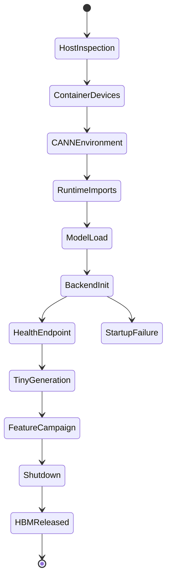

# Ascend Backend Lifecycle Deep Dive

## The Story

The Ascend backend is the layer that decides whether vLLM can actually become a server on NPU hardware. Many failures that look like vLLM bugs are really lifecycle failures before the first request:

```text
device not visible
CANN env missing
torch-npu import wrong
model/quantization unsupported
graph/custom op shape invalid
HBM not available or not released
```

## Backend Startup State Machine



## State Ledger

| State | Created | Mutated | Reused | Freed | Can become inconsistent |
| --- | --- | --- | --- | --- | --- |
| device mapping | container start | no | process lifetime | container end | container sees different NPUs than host |
| CANN runtime env | shell startup | no | process lifetime | process end | imports fail or wrong backend path |
| CPU binding | worker startup | process placement | process lifetime | process end | locale parser misreads output |
| custom op/graph state | model/backend init | graph capture | across requests | process end | shape mismatch or unsupported op |
| HBM allocation | model/KV init | request growth | across requests | shutdown/cleanup | leak after multi-instance lifecycle |
| model path | service launch | no | process lifetime | process end | stale `/mnt/data` path used |

## Failure Stories

| Story | What went wrong |
| --- | --- |
| device-count error | container mapping missing `/dev/davinci*` or manager devices |
| CPU binding locale failure | subprocess parser assumed English output |
| multi-instance HBM abnormal | worker lifecycle did not release or partition memory correctly |
| quantization startup failure | image/backend does not support model quantization mode |
| graph/custom op shape failure | captured/backend shape does not match request/model shape |

## Verification Ladder

Always climb the ladder in order:

```text
host npu-smi
container npu-smi
python import smoke
/v1/models
tiny deterministic generation
feature-specific request
/metrics or HBM check
```

Do not debug model arguments until device visibility is proven.

## Related Local Pages

- [ascend backend](../ascend_backend/README.md)
- [engine lifecycle](../engine_lifecycle/README.md)
- [#6992 CPU binding locale](../../bug_wiki/bug_capsules/VA-BUG-6992-CPU-BINDING-LOCALE.md)
- [#7308 multi-instance HBM](../../bug_wiki/bug_capsules/VA-BUG-7308-MULTI-INSTANCE-HBM.md)

## Evidence Sources

- vLLM-Ascend NPU4 startup local doc.
- vLLM-Ascend CPU binding design doc.
- Official vLLM-Ascend feature guide topics for Graph Mode, Netloader, RFork, Weight Prefetch, Quantization, and Flash Attention 3.

