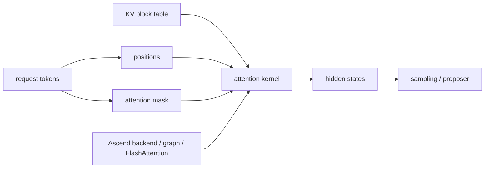

# Attention, Context Parallel, And Shape State Deep Dive

## The Story

Attention is where request shape becomes kernel shape. The scheduler can say "run these tokens," but attention must turn that into masks, positions, block tables, tensor shapes, and backend kernels. Most attention bugs are not philosophical. They are very concrete:

```text
the mask has one shape
the hidden state has another shape
the KV table points at a third shape
the backend kernel expected a fourth shape
```

## Shape Pipeline



## State Ledger

| State | Created | Mutated | Reused | Freed | Can become inconsistent |
| --- | --- | --- | --- | --- | --- |
| position state | prefill/decode step | every token | across decode | request cleanup | off-by-one at chunk or spec boundary |
| attention mask | batch construction | shape changes per step | sometimes graph-captured | step end | index out of range |
| block table | KV allocation/reuse | cache growth | across tokens | cleanup | wrong physical block read |
| graph/kernel shape | backend init/capture | rarely | across requests | process end | dynamic shape violates captured assumption |
| parallel partition state | distributed setup | topology changes unknown | across requests | process end | context/sequence parallel mismatch |

## Context Parallel Intuition

Long context makes attention expensive. Context parallelism splits long-context work across devices or ranks. This is useful, but it turns position, mask, and KV layout into distributed state. A bug can hide until the prompt is long enough or the rank partition is uneven.

## Failure Stories

| Story | What went wrong |
| --- | --- |
| EAGLE repeated calls hit `attn_mask index out of range` | proposer or mask state fails to reset across repeated calls |
| MoE + MTP + FlashComm shape mismatch | hidden-state or expert communication shape disagrees with backend |
| Long context parallel failure | mask/KV partition state differs across ranks |
| FlashAttention/backend crash | kernel receives unsupported dynamic shape |

## Fuzzer Shape

```text
short control
shape sweep around prompt/token boundaries
repeat same feature request many times
toggle MTP/EAGLE/FlashComm/context parallel where available
recovery canary
```

## Verification Strategy

- Record exact model family, prompt length, max tokens, and batch shape.
- Compare repeated-call behavior against one-shot behavior.
- Use deterministic output only as a weak oracle for attention; logs and shape tracebacks are often stronger.
- For context parallel, preserve rank/topology metadata in the capsule.

## Related Local Pages

- [attention](../attention/README.md)
- [speculative decoding](../speculative_decoding/README.md)
- [moe](../moe/README.md)
- [#3024 EAGLE attention mask](../../bug_wiki/bug_capsules/VA-BUG-3024-EAGLE-ATTN-MASK-REPEATED-CALLS.md)
- [#7996 MoE MTP FlashComm shape](../../bug_wiki/bug_capsules/VA-BUG-7996-MOE-MTP-FLASHCOMM-SHAPE.md)

## Evidence Sources

- vLLM-Ascend feature tutorials and feature-guide topics for context parallel, sequence parallelism, fine-grained tensor parallelism, and Flash Attention 3.
- Local bug wiki capsules for #3024 and #7996.

