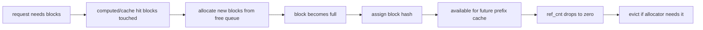

# KV Cache Deep Dive

## The Core Idea

The PagedAttention paper frames the serving bottleneck as KV cache memory that grows and shrinks dynamically. Its solution is to manage KV cache in blocks, inspired by virtual memory paging, allowing non-contiguous physical storage and sharing across requests.

For bug work, the practical idea is:

```text
logical token positions -> logical blocks -> block table -> physical KV blocks
```

## Basic State Objects

| Object | Created when | Mutated when | Freed/reused when |
| --- | --- | --- | --- |
| physical block | engine initializes KV block pool | assigned hash/ref count/ownership | request releases it and cache eviction allows reuse |
| block table entry | request allocates or reuses KV | sequence grows or cache is reused | request cleanup |
| block hash | full cacheable block is known | reset on eviction | reused by prefix-cache lookup |
| ref count | block is touched by request/cache | request starts/finishes/reuses block | drops to zero and can be evicted |

## Prefix Cache Hashing

The vLLM prefix-caching design uses a hash over:

- parent block hash
- tokens in the current block
- extra hashes such as LoRA IDs, multimodal input hashes, or cache salts

This explains why `parent_block_hash` matters in tests and why LoRA/multimodal/prefix cache are not independent features. A block that is correct for adapter A or image X may be wrong for adapter B or image Y even if the text tokens match.

## Allocation And Eviction



Critical invariant:

```text
No request should observe a block as both invalid and reusable.
```

## Hybrid KV Cache

The hybrid KV cache manager exists because not all layers need identical KV storage:

- full attention layers may need all tokens
- sliding-window layers may only need recent tokens
- some hybrid/Mamba-style models have different KV groups
- some models share KV across layers

This makes prefix cache more subtle. A prefix hit can mean different things for different layer groups.

## Bug Pattern Mapping

| Pattern | State inconsistency |
| --- | --- |
| #7871 KV load failure metrics | transfer-failed block state reaches metrics/scheduler incorrectly |
| CPU CI `parent_block_hash` | fixture missing block identity field required by cache state |
| prefix cache wrong output | hash/ref-count/block table mismatch |
| HBM leak | block/request lifecycle did not release memory |

## Test Ideas

- warm/probe shared-prefix trace
- block-boundary prompt sweep
- LoRA or multimodal extra-hash isolation test
- PD transfer failure and invalid-block cleanup
- final HBM/cache baseline check after recovery canary

## Evidence Sources

- vLLM PagedAttention paper: https://arxiv.org/abs/2309.06180
- vLLM prefix caching design: https://docs.vllm.ai/en/latest/design/prefix_caching/
- vLLM hybrid KV cache manager: https://docs.vllm.ai/en/stable/design/hybrid_kv_cache_manager/
- [KV cache feature page](../kv_cache/README.md)
- [Prefix cache feature page](../prefix_cache/README.md)

