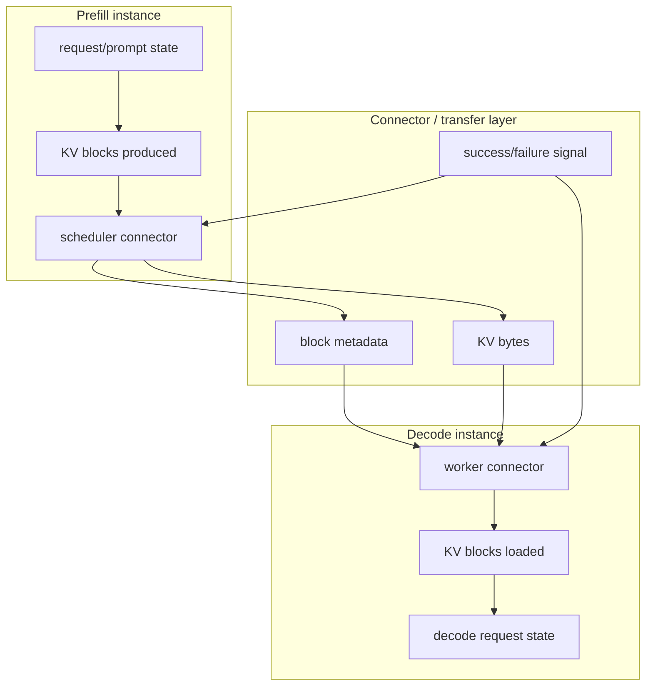
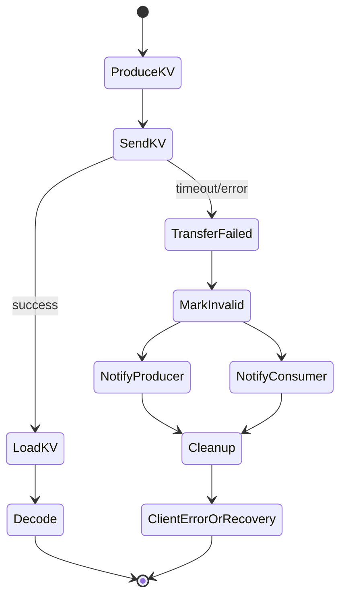

# PD And Mooncake Deep Dive

## Why PD Exists

Disaggregated prefilling separates time-to-first-token work from decode latency work. vLLM docs describe two main goals: tune TTFT and ITL separately, and control tail ITL. This is a latency architecture, not a universal throughput improvement.

## State Split



## Connector Semantics

Official vLLM docs describe disaggregated prefill abstractions:

- connector: lets a consumer retrieve KV cache from a producer
- lookup buffer: insert and drop/select operations
- scheduler connector: schedules transfer operations
- worker connectors: execute transfer operations

For bug hunting, each abstraction owns state that must agree with the others.

## Mooncake-Specific Intuition

The Mooncake RFC describes Mooncake's transfer engine as a KV-cache-centric data transfer layer with TCP/RDMA/NVMe-related capabilities and topology-aware transfer choices. In vLLM-Ascend, Mooncake appears in the bug corpus around KV failure handling and layerwise connector cleanup.

## Failure-Path State Machine



The #7871-style risk is:

```text
transfer failed -> block invalidation incomplete -> metrics/scheduler sees impossible state
```

## What To Monitor

- producer logs
- consumer logs
- connector status messages
- `/metrics` after failure
- recovery canary
- invalid block IDs
- request result at proxy/client

## Test Ideas

- PD health canary before toxic trace
- transfer failure injection if available
- overlength request through proxy as an error-propagation approximation
- layerwise on/off comparison
- `/metrics` scrape immediately after transfer failure

## Evidence Sources

- vLLM disaggregated prefill docs: https://docs.vllm.ai/en/stable/features/disagg_prefill/
- vLLM Mooncake RFC: https://github.com/vllm-project/vllm/issues/10727
- vLLM-Ascend feature tutorials: https://docs.vllm.ai/projects/ascend/en/latest/tutorials/features/index.html
- [PD feature page](../prefill_decode_disaggregation/README.md)
- [#7871 capsule](../../bug_wiki/bug_capsules/VA-BUG-7871-KV-LOAD-FAILURE-METRICS.md)

