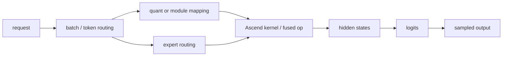

# Quantization And MoE Correctness Deep Dive

## The Story

Quantization and MoE both make the model execution path more conditional. Quantization asks, "which reduced-precision kernel or packed module should run for this layer?" MoE asks, "which experts should process these tokens, and how should their outputs be combined?"

The dangerous failure mode is not just a crash. It is a convincing HTTP 200 with wrong text.

## Execution Story



## State Ledger

| State | Created | Mutated | Reused | Freed | Can become inconsistent |
| --- | --- | --- | --- | --- | --- |
| quant config | model load | rarely | all requests | process end | model family missing from mapping |
| packed module mapping | model load | rarely | all requests | process end | wrong layer uses wrong kernel |
| expert routing | each forward | per token/batch | no | step end | wrong expert shape or rank mapping |
| fused kernel state | backend init | graph/shape capture | across requests | process end | unsupported dynamic shape |
| reference output | test setup | no | test oracle | no | missing oracle hides wrong output |

## Failure Stories

| Story | What went wrong |
| --- | --- |
| Qwen3 W8A8 garbled output | dense model not mapped to correct packed modules |
| GPT-OSS MoE incorrect output | MoE activation enum handling wrong in fused MLP |
| Qwen3.5 MoE MTP FlashComm mismatch | expert/shared-expert hidden-state shape disagrees with communication/backend |
| unsupported FP8 startup | backend does not support quantization mode in this image |

## Fuzzer Shape

```text
reference deterministic prompt
same prompt on quant/MoE path
same prompt batched with unrelated prompt
same prompt after cache warmup
recovery canary
```

## Verification Strategy

- Define the reference before running the test.
- Use prompts with easy exact answers for smoke, and real benchmark prompts for deeper validation.
- Record model family, quantization mode, image, and backend flags.
- Treat garbled output as a correctness finding only when a reference or invariant is recorded.

## Related Local Pages

- [quantization](../quantization/README.md)
- [moe](../moe/README.md)
- [#2318 W8A8 Qwen3 garbled](../../bug_wiki/bug_capsules/VA-BUG-2318-W8A8-QWEN3-GARBLED.md)
- [#8463 GPT-OSS MoE correctness](../../bug_wiki/bug_capsules/VA-BUG-8463-GPTOSS-MOE-OUTPUT-CORRECTNESS.md)
- [#7996 MoE MTP FlashComm shape](../../bug_wiki/bug_capsules/VA-BUG-7996-MOE-MTP-FLASHCOMM-SHAPE.md)

## Evidence Sources

- vLLM-Ascend official Quantization Guide and MoE/FlashComm-related feature tutorials.
- Local PR-centric bug capsules for quantization and MoE correctness.

