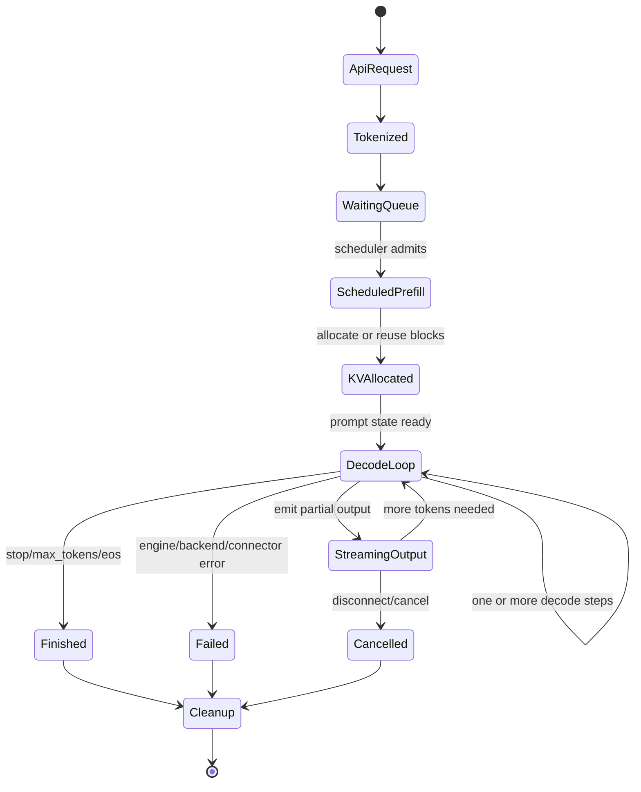
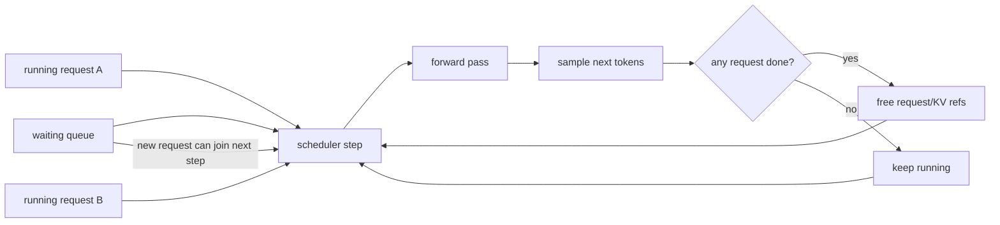
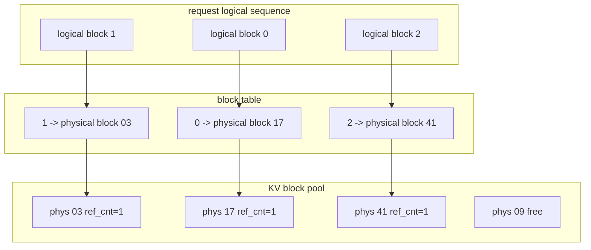
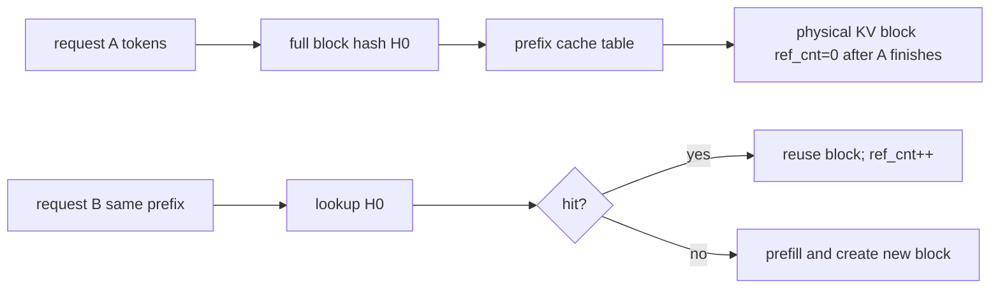
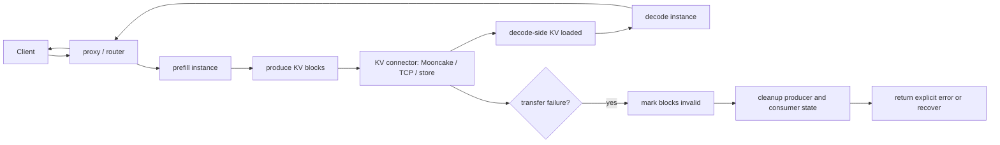
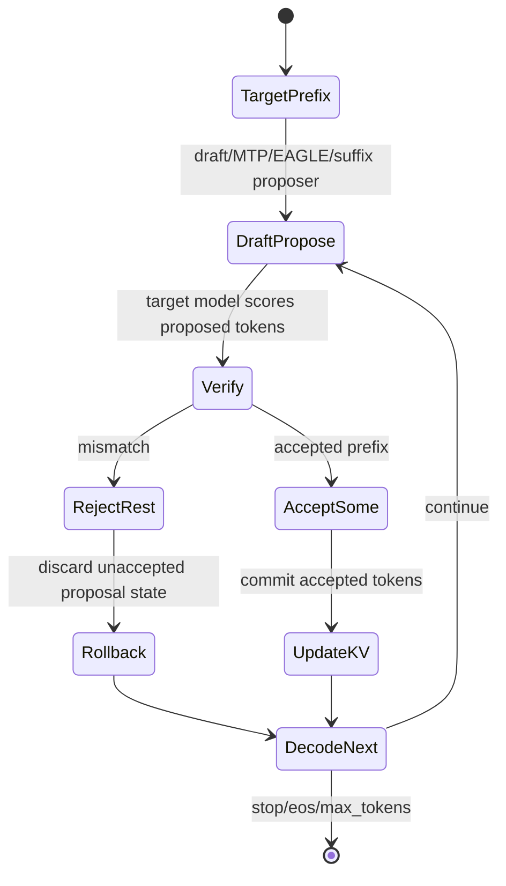
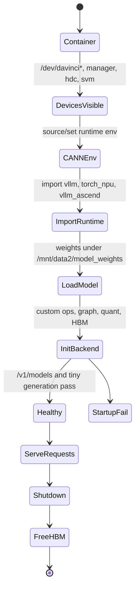

# Theory Illustrations

This page gives the mental model behind the feature wiki. It is not a reproduction guide. It explains how vLLM/vLLM-Ascend state moves, mutates, gets reused, and can become inconsistent.

## Source Backbone

The theory here is grounded in:

- vLLM PagedAttention paper: https://arxiv.org/abs/2309.06180
- vLLM prefix caching design: https://docs.vllm.ai/en/stable/design/prefix_caching/
- vLLM hybrid KV cache manager design: https://docs.vllm.ai/en/latest/design/hybrid_kv_cache_manager/
- vLLM GitHub repository feature summary: https://github.com/vllm-project/vllm
- vLLM KV cache manager source: https://github.com/vllm-project/vllm/blob/main/vllm/v1/core/single_type_kv_cache_manager.py
- vLLM-Ascend feature tutorials: https://docs.vllm.ai/projects/ascend/en/latest/tutorials/features/index.html
- vLLM-Ascend design documents: https://docs.vllm.ai/projects/ascend/en/main/developer_guide/Design_Documents/index.html
- vLLM-Ascend CPU binding design: https://docs.vllm.ai/projects/ascend/en/latest/developer_guide/Design_Documents/cpu_binding.html
- vLLM-Ascend KV Cache CPU Offload guide: https://docs.vllm.ai/projects/ascend/en/main/user_guide/feature_guide/kv_cache_cpu_offload.html
- vLLM disaggregated-prefill RFC: https://github.com/vllm-project/vllm/issues/10818
- vLLM-Ascend PD RFC: https://github.com/vllm-project/vllm-ascend/issues/841
- vLLM-Ascend layerwise KV transfer RFC: https://github.com/vllm-project/vllm-ascend/issues/2470

More detailed source notes, including supplementary Zhihu/general web material, are in [SOURCE_NOTES.md](SOURCE_NOTES.md).

## Companion Deep Dives

- [GLOSSARY.md](GLOSSARY.md): terms translated into state ownership and bug risk.
- [STATE_INVARIANTS.md](STATE_INVARIANTS.md): subsystem invariants to check during triage.
- [FUZZER_PLAYBOOKS.md](FUZZER_PLAYBOOKS.md): seed/oracle/monitor playbooks.
- [BUG_READING_WORKFLOW.md](BUG_READING_WORKFLOW.md): turn issue symptoms into feature-state hypotheses.
- [SCHEDULER_DEEP_DIVE.md](SCHEDULER_DEEP_DIVE.md): continuous batching and scheduler liveness as a per-step state machine.
- [KV_CACHE_DEEP_DIVE.md](KV_CACHE_DEEP_DIVE.md): block, hash, ref-count, hybrid KV cache explanation.
- [ATTENTION_DEEP_DIVE.md](ATTENTION_DEEP_DIVE.md): masks, positions, kernel shape, and context-parallel attention state.
- [SAMPLING_AND_SPEC_DEEP_DIVE.md](SAMPLING_AND_SPEC_DEEP_DIVE.md): logits, grammar masks, speculative proposal/verification, and correctness oracles.
- [STREAMING_LIFECYCLE_DEEP_DIVE.md](STREAMING_LIFECYCLE_DEEP_DIVE.md): stream output, disconnect, cancel, and cleanup ownership.
- [PD_MOONCAKE_DEEP_DIVE.md](PD_MOONCAKE_DEEP_DIVE.md): prefill/decode and Mooncake transfer state.
- [QUANT_MOE_DEEP_DIVE.md](QUANT_MOE_DEEP_DIVE.md): quantized kernel and MoE routing state.
- [ASCEND_BACKEND_DEEP_DIVE.md](ASCEND_BACKEND_DEEP_DIVE.md): container, CANN, torch-npu, custom ops, graph, and HBM lifecycle.

## 1. Whole Engine State Machine

The easiest way to understand vLLM is to stop thinking of it as "one request runs a model" and start thinking of it as "many requests borrow pieces of a shared state machine."



State created:

- request object
- token IDs
- scheduler entry
- KV block table entries
- output stream state
- metrics/tracing labels

State mutated:

- queue position
- token progress
- block allocation/ref counts
- accepted/rejected tokens
- partial response buffers

State freed:

- request state
- KV block references
- stream/output handler state
- distributed transfer state

Risk intuition: most "weird" vLLM bugs happen when one subsystem thinks the request is done while another subsystem still owns blocks, tokens, metrics, or transfer state.

## 2. Continuous Batching As A Per-Step Scheduler

Static batching waits for a whole batch to finish. vLLM-style continuous batching can change the batch between iterations.



Why this matters for fuzzing:

- A request can join while other requests already own KV blocks.
- A finished request frees blocks while other requests continue.
- A long prefill can block or reshape scheduling decisions.
- Cancellation/disconnect is a scheduler cleanup event, not just an HTTP event.

Bug classes:

- scheduler hang
- wrong admission when KV capacity is tight
- recovery canary fails after toxic trace
- dynamic batch or graph capture shape mismatch

Local links:

- [scheduler](../scheduler/README.md)
- [engine lifecycle](../engine_lifecycle/README.md)
- [#4986 MTP full-decode hang](../../bug_wiki/bug_capsules/VA-BUG-4986-MTP-FULL-DECODE-HANG.md)

## 3. Paged KV Cache Mental Model

PagedAttention treats KV memory like a block/page system. A sequence has logical blocks; physical memory can be non-contiguous.



The important fields are:

- block ID: stable identity for a physical block
- block hash: assigned when a full block becomes cacheable
- ref count: how many active requests refer to it
- free queue links: how blocks return to the pool

Risk intuition:

- Wrong ref count means leak or premature reuse.
- Wrong hash means false cache hit or missed reuse.
- Missing parent/block metadata breaks cache transfer or CI fixtures.
- Failure cleanup must invalidate bad blocks before another request observes them.

Local links:

- [KV cache](../kv_cache/README.md)
- [prefix cache](../prefix_cache/README.md)
- [#7871 KV load failure](../../bug_wiki/bug_capsules/VA-BUG-7871-KV-LOAD-FAILURE-METRICS.md)
- [CPU CI BlockStored parent hash](../../bug_wiki/bug_capsules/VA-BUG-CPUCI-BLOCKSTORED-PARENT-HASH.md)

## 4. Prefix Cache: Hash, Reuse, Ref Count

Prefix cache is "KV cache reuse across requests." A full block can be hashed from its tokens and prior prefix context, then reused by a later request with the same prefix.



What can become inconsistent:

- hash key omits part of the true prefix state
- block is evicted between accounting hit and physical reuse
- ref count is wrong after cancellation
- chunked prefill changes boundary behavior
- speculative decode changes observable cache metrics

Useful fuzzer shape:

```text
warm shared prefix -> probe same prefix -> mutate suffix -> recovery canary
```

Local links:

- [prefix cache](../prefix_cache/README.md)
- [KV cache](../kv_cache/README.md)
- [#5445 chunk prefill long sequence](../../bug_wiki/bug_capsules/VA-BUG-5445-CHUNK-PREFILL-LONG-SEQUENCE.md)

## 5. Prefill/Decode Disaggregation And Mooncake

PD disaggregation splits prompt prefill from token decode. The prefiller creates KV blocks, and the decoder consumes transferred KV blocks.



The hard part is not just moving bytes. The hard part is agreeing on state:

- producer thinks block sent
- connector thinks send failed
- consumer may have partial load
- scheduler must know whether request can continue
- metrics must record the failure without throwing

Local links:

- [prefill/decode disaggregation](../prefill_decode_disaggregation/README.md)
- [distributed](../distributed/README.md)
- [#7871 KV load failure metrics](../../bug_wiki/bug_capsules/VA-BUG-7871-KV-LOAD-FAILURE-METRICS.md)
- [#6273 KV pool layerwise pooling](../../bug_wiki/bug_capsules/VA-BUG-6273-KVPOOL-LAYERWISE-POOLING.md)

## 6. Speculative Decoding State

Speculative decoding proposes draft tokens, verifies them, accepts a prefix, and rejects the rest.



Risk intuition:

- If accepted-token indexing is wrong, output correctness breaks.
- If rejected tokens leave KV/attention state behind, later tokens break.
- If graph capture assumes a fixed shape, MTP/decode-only paths can hang.
- If EAGLE attention masks do not reset across repeated calls, index errors appear.

Local links:

- [speculative decoding](../speculative_decoding/README.md)
- [sampling](../sampling/README.md)
- [attention](../attention/README.md)
- [#7807 block verify](../../bug_wiki/bug_capsules/VA-BUG-7807-BLOCK-VERIFY-REJECTION-SAMPLING.md)
- [#3024 EAGLE attention mask](../../bug_wiki/bug_capsules/VA-BUG-3024-EAGLE-ATTN-MASK-REPEATED-CALLS.md)

## 7. Ascend Backend Lifecycle

On Ascend, many failures happen before request-level fuzzing begins. Treat backend startup as its own state machine.



Backend state that often matters:

- actual visible NPU IDs, not assumed IDs
- CPU binding and host locale
- CANN/torch-npu compatibility
- graph capture shape
- HBM allocator state
- quantization/custom op model mapping

Local links:

- [ascend backend](../ascend_backend/README.md)
- [engine lifecycle](../engine_lifecycle/README.md)
- [#6992 CPU binding locale](../../bug_wiki/bug_capsules/VA-BUG-6992-CPU-BINDING-LOCALE.md)
- [#7308 multi-instance HBM](../../bug_wiki/bug_capsules/VA-BUG-7308-MULTI-INSTANCE-HBM.md)

## 8. How To Turn Theory Into Tests

For each feature, ask six state questions:

| Question | Example |
| --- | --- |
| What state is created? | KV blocks, request entry, stream object |
| What state is mutated? | block ref count, decode position, accepted tokens |
| What state is cached? | prefix KV blocks, model weights, graph captures |
| What state is reused? | shared prefix blocks, LoRA adapter weights, offloaded KV |
| What state is freed? | request blocks, output buffers, HBM allocations |
| What can become inconsistent? | scheduler says done while connector says loading failed |

Then design the seed:

```text
control -> create state -> mutate/reuse state -> trigger edge -> recovery canary -> monitor cleanup
```

Good examples:

- shared prefix warm/probe/recovery for prefix cache
- PD transfer failure plus `/metrics` scrape for Mooncake
- speculative off/on deterministic comparison for block verify
- streaming disconnect plus recovery canary for lifecycle
- multi-instance start/stop plus HBM baseline for Ascend backend
