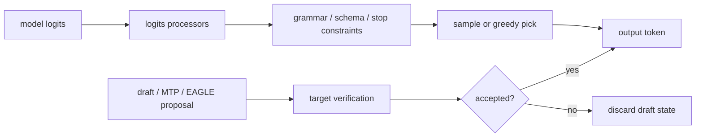

# Sampling, Structured Output, And Speculative Decoding Deep Dive

## The Story

Sampling is the moment logits become user-visible text. Speculative decoding complicates that story: the engine may create draft tokens, verify them, accept some, reject others, and then continue. Structured output complicates it another way: the sampler must obey a schema or grammar.

The risk is silent correctness failure. The server can return HTTP 200 while the wrong token was accepted or the wrong quantized path produced nonsense.

## Token Decision Pipeline



## State Ledger

| State | Created | Mutated | Reused | Freed | Can become inconsistent |
| --- | --- | --- | --- | --- | --- |
| sampling params | request arrival | rarely | no | request cleanup | wrong precedence or unsupported combo |
| logits/bitmask | each decode step | processors and grammar apply | no | step end | type/shape mismatch |
| output tokens | every accepted token | append/finish | across stream chunks | response done | wrong token accepted |
| draft tokens | speculative proposal | verification accepts/rejects | within request | rejected/finish | rejected token leaves KV/output residue |
| grammar state | structured-output setup | token acceptance | across decode steps | request cleanup | schema state desync |

## Failure Stories

| Story | What went wrong |
| --- | --- |
| block verify incorrect | accepted/rejected token indexing is wrong |
| xgrammar type mismatch | structured-output bitmask type does not match backend function |
| batch invariance failure | same prompt changes output when batched with another request |
| quantized model garbles output | sampler receives logits from wrong backend mapping |

## Fuzzer Shape

```text
temperature=0 baseline
same prompt with feature enabled
same prompt in a mixed batch
structured-output schema request
speculative repeated-call request
recovery canary
```

## Verification Strategy

- Use deterministic prompts whenever possible.
- For correctness bugs, always define the reference: non-spec baseline, Transformers, unquantized model, or fixed image.
- For structured output, validate the response schema rather than eyeballing text.
- For speculative decoding, track accepted tokens if metrics/logs expose them.

## Related Local Pages

- [sampling](../sampling/README.md)
- [speculative decoding](../speculative_decoding/README.md)
- [quantization](../quantization/README.md)
- [#7807 block verify](../../bug_wiki/bug_capsules/VA-BUG-7807-BLOCK-VERIFY-REJECTION-SAMPLING.md)
- [#5524 xgrammar](../../bug_wiki/bug_capsules/VA-BUG-5524-XGRAMMAR-TYPE-MISMATCH.md)

## Evidence Sources

- vLLM-Ascend official feature-guide topics for Structured Output, Multi Token Prediction, Speculative Decoding, Suffix Speculative Decoding, and Batch Invariance.
- Local bug wiki capsules for #7807, #5524, and #2318.

