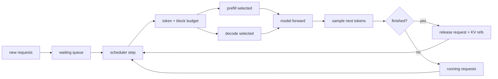

# Scheduler And Continuous Batching Deep Dive

## The Story

The scheduler is the traffic controller of the engine. A request does not simply "run the model"; it repeatedly asks for permission to spend tokens, KV blocks, and backend time. Every scheduler step is a small negotiation:

```text
Who can prefill?
Who can decode one more token?
Who must wait for KV, memory, graph shape, or a distributed peer?
Who is done and can release state?
```

This is why scheduler bugs often look like ghosts: the service still listens, but one request is no longer moving.

## Continuous Batching

Continuous batching changes the batch between engine iterations. A long request, a short request, and a newly arrived request can share the same model process without waiting for a static batch to drain.



## State Ledger

| State | Created | Mutated | Reused | Freed | Can become inconsistent |
| --- | --- | --- | --- | --- | --- |
| waiting queue entry | request arrival | priority/admission changes | no | admitted or cancelled | request remains queued forever |
| running request state | scheduler admits request | every decode step | across steps | finish/fail/cancel | marked running but no progress |
| token budget | each scheduler step | while selecting requests | no | end of step | over-admits or starves |
| KV block budget | from cache manager | as blocks are allocated/freed | across requests | cleanup/eviction | scheduler thinks blocks exist but cache disagrees |
| output state | first generated token | stream chunks | across decode loop | request end | output handler waits after request died |

## Failure Stories

| Story | What went wrong |
| --- | --- |
| Long prompt blocks tiny canary | prefill budget or chunk state prevents decode progress |
| MTP full-decode hangs | proposer/graph/scheduler state does not advance to next step |
| Recovery request fails | toxic trace left global scheduler/KV/backend state dirty |
| Dynamic batch correctness drift | same request behaves differently because batch shape changed hidden state |

## Fuzzer Shape

```text
baseline canary
mixed short/long burst
one toxic long/chunked/MTP request
short recovery canary with strict timeout
/metrics or log check
```

## Verification Strategy

- Always run a control canary before and after the toxic trace.
- Treat "port open but request hung" as scheduler/distributed/lifecycle evidence.
- Track prompt length, max tokens, chunked prefill, graph, and speculative flags.
- If graph/dynamic batching is involved, compare single-request and batched execution.

## Related Local Pages

- [scheduler](../scheduler/README.md)
- [engine lifecycle](../engine_lifecycle/README.md)
- [#4986 MTP full-decode hang](../../bug_wiki/bug_capsules/VA-BUG-4986-MTP-FULL-DECODE-HANG.md)
- [#5445 chunk prefill long sequence](../../bug_wiki/bug_capsules/VA-BUG-5445-CHUNK-PREFILL-LONG-SEQUENCE.md)

## Evidence Sources

- vLLM repository feature summary: https://github.com/vllm-project/vllm
- vLLM-Ascend feature tutorials: https://docs.vllm.ai/projects/ascend/en/latest/tutorials/features/index.html
- Local bug wiki scheduler and workload pattern pages.

