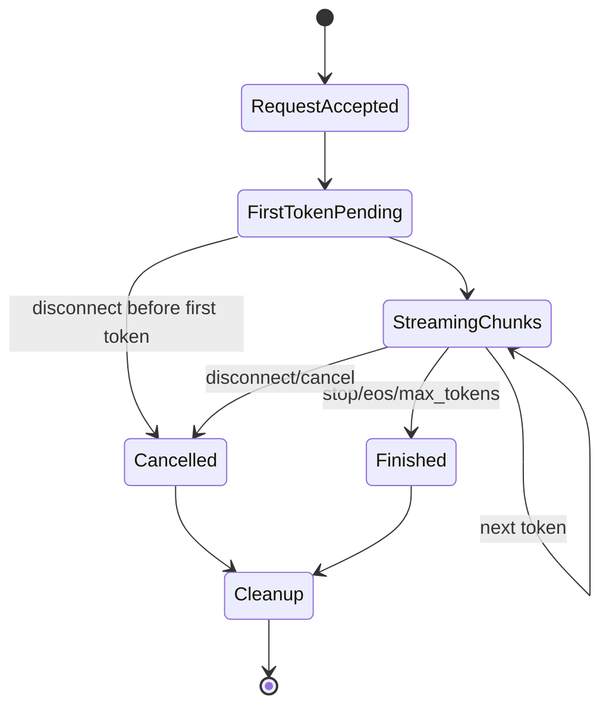

# Streaming And Cancel Lifecycle Deep Dive

## The Story

Streaming turns one response into a long-lived conversation between the engine, output handler, and client connection. Cancel/disconnect bugs happen when those parties disagree about whether the request is still alive.

```text
client says gone
HTTP layer says stream closed
scheduler still has a running request
KV cache still has blocks
output handler still waits for tokens
```

## Streaming State Machine



## State Ledger

| State | Created | Mutated | Reused | Freed | Can become inconsistent |
| --- | --- | --- | --- | --- | --- |
| stream object | API accepts stream request | chunk emission | no | stream end/cancel | output handler writes after close |
| request status | scheduler admits | running/finished/cancelled | across steps | cleanup | scheduler does not see cancel |
| KV refs | prefill/decode | decode extends | across stream | cleanup | cancelled stream leaks blocks |
| client connection | HTTP layer | chunks and disconnect | no | disconnect/end | engine keeps generating for gone client |
| metrics | request lifecycle | token/time/error updates | no | scrape persists | error path double-counts or throws |

## Failure Stories

| Story | What went wrong |
| --- | --- |
| disconnect before first token hangs | scheduler waits for output path that no longer exists |
| cancel after first token leaks state | KV/request cleanup did not run |
| proxy stream closes silently | distributed/proxy error not translated into response |
| recovery canary fails | cancelled request left global state dirty |

## Fuzzer Shape

```text
streaming control
disconnect before first token
disconnect after first token
cancel long stream
retry same prompt
recovery canary
```

## Verification Strategy

- Test both before-first-token and after-first-token disconnects.
- Always send a recovery canary after cancellation.
- Watch logs for output handler errors, not just HTTP status.
- If PD/proxy is involved, inspect proxy and backend logs separately.

## Related Local Pages

- [streaming](../streaming/README.md)
- [engine lifecycle](../engine_lifecycle/README.md)
- [lifecycle/cancel workload pattern](../../bug_wiki/workload_patterns/LIFECYCLE_CANCEL.md)

## Evidence Sources

- GRIEF first smoke report includes a streaming seed.
- Local fuzzer findability notes classify cancel/disconnect lifecycle bugs as directly findable when the target issue exists.

